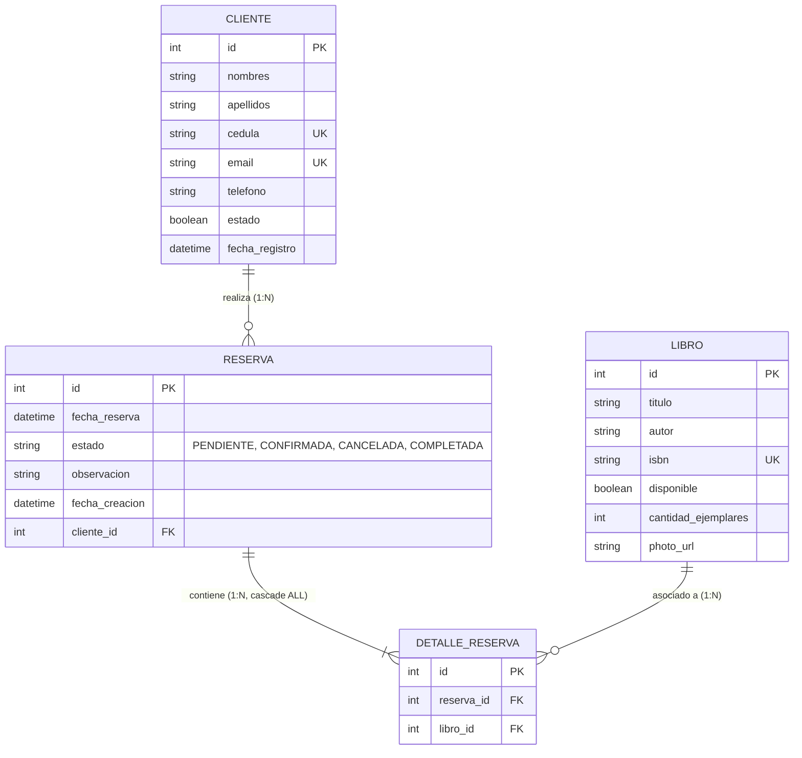

# Módulo de Reservas Full-Stack (biblapp)

| | |
| --- | --- |
| **Status** | Completed |
| **Date** | 2026-09-29 |
| **Scope** | `biblapp-backend` + `biblapp-frontend` |
| **Affects** | `Reserva`, `DetalleReserva`, `IReservaRepo`, `IReservaService`, `ReservaServiceImpl`, `ReservaController`, `ReservaDto`, `DetalleReservaDto`, `reserva.ts`, `reserva.service.ts`, `reserva.store.ts`, `reserva.form.ts`, `reserva.component.*`, `reserva-edit.component.*`, `app.routes.ts`, `layout.component.html` |

---

# Parte 1 — Especificación Funcional

## 1.1 Contexto y Problema

Actualmente, el sistema **BIBLAPP** permite la gestión de catálogos de **Categorías**, **Clientes** y **Libros** (incluyendo carga de portadas fotográficas). Sin embargo, carece del flujo transaccional central de la biblioteca: **la gestión de Reservas de libros por parte de los clientes**.

Se requiere implementar una solución completa e integral (Full-Stack) que permita:
1. **Registrar una nueva reserva**: Seleccionando un cliente activo y asociando uno o más libros disponibles mediante líneas de detalle (`DetalleReserva`).
2. **Listar las reservas registradas**: Visualizando la información general de la reserva (cliente, fecha, estado, total de libros, observaciones) en una tabla interactiva con filtros, paginación y visualización del detalle de libros reservados.

## 1.2 Objetivos

* Proveer un flujo de registro intuitivo, ágil y reactivo en el frontend, donde el usuario pueda buscar/seleccionar un cliente, añadir libros dinámicamente a una tabla temporal de detalle, validar cantidades y disponibilidad, y persistir la transacción completa en un único payload JSON hacia el backend.
* Garantizar la integridad transaccional en el backend mediante `@Transactional`, asegurando que la cabecera `Reserva` y la lista de `DetalleReserva` se inserten atómicamente, enlazando correctamente la clave foránea bidireccional.
* Proveer una consulta de listado eficiente que prevenga el problema de consultas $N+1$ y excepciones por *Lazy Loading* (`LazyInitializationException`) al consultar el grafo de entidades `Reserva -> Cliente` y `Reserva -> DetalleReserva -> Libro`.
* Mantener consistencia visual y de diseño con los módulos existentes basados en **Angular 22+**, **Angular Material 22**, **Signals**, **httpResource** y **Tailored Modern Dark/Glass Theme**.

## 1.3 Alcance

### En Alcance (In Scope):
* **Backend**:
  * Ajuste y optimización de `IReservaRepo` con consultas optimizadas (`JOIN FETCH` o `@EntityGraph`) para listar reservas con su cliente y detalles de libros asociados.
  * Lógica de servicio en `ReservaServiceImpl` para validar existencia del cliente, disponibilidad de los libros seleccionados y vinculación en cascada de los detalles (`DetalleReserva.reserva = reserva`).
  * Endpoints RESTful en `ReservaController`:
    * `GET /v1/reserva` (Listar todas las reservas con sus relaciones mapeadas a DTO).
    * `GET /v1/reserva/{id}` (Obtener detalle completo de una reserva por ID).
    * `POST /v1/reserva` (Registrar nueva reserva validando payload `ReservaDto`).
    * `PUT /v1/reserva/{id}/estado` o `PUT /v1/reserva/{id}` (Actualizar estado: PENDIENTE, CONFIRMADA, CANCELADA, COMPLETADA).
    * `DELETE /v1/reserva/{id}` (Eliminar o anular reserva).
* **Frontend**:
  * Modelo TypeScript `reserva.ts` (`Reserva`, `DetalleReserva`, enum `EstadoReserva`).
  * Servicio `ReservaService` que extienda `GenericService<Reserva>`.
  * Store reactivo `ReservaStore` basado en `httpResource` y Angular Signals.
  * Formulario reactivo con Signals (`ReservaForm`) con validaciones de cabecera y detalle.
  * Componente de Listado `ReservaComponent` (`/pages/reserva`):
    * Tabla `mat-table` con columnas: ID, Cliente, Fecha de Reserva, Cantidad de Libros, Estado (con Chips por color), Observación y Acciones.
    * Buscador en tiempo real y paginador `mat-paginator`.
    * Modal o panel expandible para ver los libros del `DetalleReserva`.
  * Componente de Registro `ReservaEditComponent` (`/pages/reserva/new`):
    * Selector/autocompletado de cliente con datos del cliente seleccionado.
    * Selector de fecha de reserva y campo de observaciones.
    * Sección de Detalle: Selector/búsqueda de libro, botón para agregar al detalle, validación de libro no duplicado y tabla de libros agregados con opción de remover ítem.
    * Botón de confirmación y guardado con barra de progreso y notificaciones `MatSnackBar`.
  * Configuración de rutas en `app.routes.ts` y enlace de menú en `layout.component.html`.

### Fuera de Alcance (Out of Scope):
* Sistema de préstamos físicos con control de fechas de devolución tardía o cálculo de multas monetarias (módulo posterior).
* Pasarela de pago o cobro por reserva.
* Notificaciones por correo electrónico al cliente (se considerará en una fase posterior).

---

# Parte 2 — Backend (`biblapp-backend`)

## 2.1 Modelo de Datos y Entidades JPA

Las entidades ya existen en la base de datos PostgreSQL/Supabase bajo el esquema relacional:



### Entidades Java Clave:
* `Reserva`:
  * `@ManyToOne(fetch = FetchType.LAZY, optional = false)` hacia `Cliente`.
  * `@OneToMany(mappedBy = "reserva", cascade = CascadeType.ALL, orphanRemoval = true)` hacia `DetalleReserva`.
  * Método helper:
    ```java
    public void addDetalle(DetalleReserva detalle) {
        if (this.detallesReserva == null) {
            this.detallesReserva = new ArrayList<>();
        }
        this.detallesReserva.add(detalle);
        detalle.setReserva(this);
    }
    ```
* `DetalleReserva`:
  * `@ManyToOne(fetch = FetchType.LAZY, optional = false)` hacia `Reserva`.
  * `@ManyToOne(fetch = FetchType.LAZY, optional = false)` hacia `Libro`.

## 2.2 DTOs y Contratos de Validación

### `ReservaDto`
```java
public class ReservaDto {
    private Integer id;

    @NotNull(message = "La fecha de reserva es requerida")
    private LocalDateTime fechaReserva;

    private EstadoReserva estado = EstadoReserva.PENDIENTE;

    @Size(max = 500, message = "La observación no debe exceder 500 caracteres")
    private String observacion;

    private LocalDateTime fechaCreacion;

    @NotNull(message = "El cliente es requerido")
    private ClienteDto cliente;

    @NotEmpty(message = "La reserva debe contener al menos un libro")
    @Valid
    private List<DetalleReservaDto> detallesReserva;
}
```

### `DetalleReservaDto`
```java
public class DetalleReservaDto {
    private Integer id;

    @NotNull(message = "El libro es requerido en el detalle")
    private LibroDto libro;
}
```

## 2.3 Repositorio Optimizado (`IReservaRepo`)

Para evitar errores de `LazyInitializationException` y el problema de $N+1$ queries al consultar `findAll()`:

```java
@Repository
public interface IReservaRepo extends IGenericRepo<Reserva, Integer> {

    @Query("SELECT DISTINCT r FROM Reserva r " +
           "LEFT JOIN FETCH r.cliente " +
           "LEFT JOIN FETCH r.detallesReserva d " +
           "LEFT JOIN FETCH d.libro l " +
           "LEFT JOIN FETCH l.categoria " +
           "ORDER BY r.id DESC")
    List<Reserva> findAllWithDetails();

    @Query("SELECT r FROM Reserva r " +
           "LEFT JOIN FETCH r.cliente " +
           "LEFT JOIN FETCH r.detallesReserva d " +
           "LEFT JOIN FETCH d.libro l " +
           "WHERE r.id = :id")
    Optional<Reserva> findByIdWithDetails(@Param("id") Integer id);
}
```

## 2.4 Lógica de Negocio (`ReservaServiceImpl`)

1. **Persistencia Atómica**:
   ```java
   @Override
   @Transactional
   public Reserva save(Reserva entity) throws Exception {
       if (entity.getDetallesReserva() == null || entity.getDetallesReserva().isEmpty()) {
           throw new ModelNotFoundException("La reserva debe contener al menos un libro en el detalle");
       }

       // Validar cliente
       Cliente cliente = clienteRepo.findById(entity.getCliente().getId())
           .orElseThrow(() -> new ModelNotFoundException("Cliente no encontrado con ID: " + entity.getCliente().getId()));
       entity.setCliente(cliente);

       // Asignar relación bidireccional y validar libros
       for (DetalleReserva detalle : entity.getDetallesReserva()) {
           Libro libro = libroRepo.findById(detalle.getLibro().getId())
               .orElseThrow(() -> new ModelNotFoundException("Libro no encontrado con ID: " + detalle.getLibro().getId()));
           
           if (!Boolean.TRUE.equals(libro.getDisponible())) {
               throw new IllegalStateException("El libro '" + libro.getTitulo() + "' no se encuentra disponible para reserva");
           }
           detalle.setLibro(libro);
           detalle.setReserva(entity);
       }

       if (entity.getEstado() == null) {
           entity.setEstado(EstadoReserva.PENDIENTE);
       }

       return iReservaRepo.save(entity);
   }
   ```
2. **Listado con DTO Mapping**:
   En `findAll()`, utilizar `iReservaRepo.findAllWithDetails()` asegurando que la colección y relaciones vengan completamente cargadas en memoria.

## 2.5 Endpoints REST (`ReservaController`)

| Método | Endpoint | Request Body | Response Status | Descripción |
| --- | --- | --- | --- | --- |
| `GET` | `/v1/reserva` | - | `200 OK` | Retorna lista de todas las reservas con cliente y libros en detalle. |
| `GET` | `/v1/reserva/{id}` | - | `200 OK` | Retorna una reserva específica por su ID. |
| `POST` | `/v1/reserva` | `ReservaDto` (JSON) | `201 Created` | Registra la reserva y sus detalles; retorna `Location: /v1/reserva/{id}`. |
| `PUT` | `/v1/reserva/{id}` | `ReservaDto` (JSON) | `200 OK` | Actualiza estado u observaciones de la reserva. |
| `PATCH`| `/v1/reserva/{id}/estado?estado=CONFIRMADA` | - | `200 OK` | Cambio rápido de estado de la reserva. |
| `DELETE` | `/v1/reserva/{id}` | - | `204 No Content` | Elimina la reserva y sus detalles en cascada. |

---

# Parte 3 — Frontend (`biblapp-frontend`)

## 3.1 Modelos TypeScript (`src/app/model/reserva.ts`)

```typescript
import { Cliente } from './cliente';
import { Libro } from './libro';

export type EstadoReserva = 'PENDIENTE' | 'CONFIRMADA' | 'CANCELADA' | 'COMPLETADA';

export interface DetalleReserva {
  id?: number | null;
  libro: Libro;
}

export interface Reserva {
  id?: number | null;
  fechaReserva: string;
  estado?: EstadoReserva;
  observacion?: string | null;
  fechaCreacion?: string;
  cliente: Cliente;
  detallesReserva: DetalleReserva[];
}
```

## 3.2 Servicio Angular (`src/app/services/reserva.service.ts`)

```typescript
import { Injectable } from '@angular/core';
import { environment } from '../../environments/environment.development';
import { Reserva, EstadoReserva } from '../model/reserva';
import { GenericService } from './generic.service';

@Injectable({ providedIn: 'root' })
export class ReservaService extends GenericService<Reserva> {
  protected override url = `${environment.HOST}/v1/reserva`;

  cambiarEstado(id: number, estado: EstadoReserva) {
    return this.http.patch<Reserva>(`${this.url}/${id}/estado`, null, {
      params: { estado }
    });
  }
}
```

## 3.3 Store Reactivo (`src/app/store/reserva.store.ts`)

Uso del patrón moderno `httpResource` de Angular 19:

```typescript
import { inject, Injectable } from '@angular/core';
import { ReservaService } from '../services/reserva.service';
import { httpResource } from '@angular/common/http';
import { Reserva } from '../model/reserva';

@Injectable({ providedIn: 'root' })
export class ReservaStore {
  private readonly reservaService = inject(ReservaService);

  readonly reservaResource = httpResource<Reserva[]>(
    () => this.reservaService.resourceUrl,
    { defaultValue: [] }
  );

  readonly $reservas = this.reservaResource.value;
  readonly $loading = this.reservaResource.isLoading;
  readonly $error = this.reservaResource.error;

  reload() {
    this.reservaResource.reload();
  }
}
```

## 3.4 Pantalla de Listado: `ReservaComponent` (`/pages/reserva`)

### Características y UI/UX:
* **Cabecera**:
  * Título con icono `book_online` ("Reservas").
  * Subtítulo explicativo: "Gestión de reservas de libros y préstamos de clientes".
  * Campo de búsqueda en vivo con filtrado sobre cliente (nombres, apellidos, cédula) o ID de reserva.
  * Botón de acción principal: "Nueva Reserva" con icono `add` que navega a `/pages/reserva/new`.
* **Tabla de Datos (`mat-table`)**:
  * **ID**: `#{{ row.id }}` con estilo monoespaciado.
  * **Cliente**: Nombre completo del cliente (`{{ row.cliente.nombres }} {{ row.cliente.apellidos }}`) y su cédula en subtítulo gris.
  * **Fecha de Reserva**: Formateada como `dd/MM/yyyy HH:mm`.
  * **Cant. Libros**: Badge o chip indicando el número de libros incluidos (`row.detallesReserva.length`).
  * **Estado**: `mat-chip` con clases según el estado:
    * `PENDIENTE`: Amarillo / Ámbar (`chip-warning`).
    * `CONFIRMADA`: Azul (`chip-info`).
    * `COMPLETADA`: Verde esmeralda (`chip-success`).
    * `CANCELADA`: Rojo / Opaco (`chip-danger`).
  * **Observación**: Texto truncado con tooltip para ver la observación completa.
  * **Acciones**:
    * Botón "Ver Detalle" (abre diálogo con la lista de libros reservados, portadas y datos del libro).
    * Menú contextual o botón para cancelar/cambiar estado.
    * Botón "Eliminar" con diálogo de confirmación `ConfirmDialogComponent`.
* **Paginador**: `mat-paginator` con opciones `[5, 10, 25, 50]`.

## 3.5 Pantalla de Registro: `ReservaEditComponent` (`/pages/reserva/new`)

### Secciones y Componentes del Formulario:
1. **Paso/Sección 1 — Datos de la Reserva**:
   * Selector de Fecha (`matDatepicker` o `input type="datetime-local"`), precargado con la fecha/hora actual.
   * Campo de texto multilínea para `observacion` (opcional, máx. 500 caracteres).
2. **Paso/Sección 2 — Selección de Cliente**:
   * Dropdown con filtro / autocompletado (`mat-select` o `mat-autocomplete`) que carga clientes activos mediante `ClienteService.findAll()`.
   * Tarjeta de resumen del cliente seleccionado mostrando: Cédula, Nombres, Email y Teléfono.
3. **Paso/Sección 3 — Selección de Libros y Detalle (`DetalleReserva`)**:
   * Dropdown / autocompletado para seleccionar libros disponibles desde `LibroService.findAll()`.
   * Botón "Agregar Libro" con validaciones:
     * El libro seleccionado no puede estar ya presente en la lista de detalles actual (evitar duplicados).
     * El libro debe tener `disponible === true`.
   * **Tabla dinámica de Detalle**:
     * Columnas: Portada (miniatura con fallback a `/default-book.svg`), Título, Autor, Categoría, ISBN, Acción (botón eliminar fila).
     * Mensaje de aviso cuando no hay libros agregados ("Debe agregar al menos un libro para registrar la reserva").
     * Resumen en el pie: Total de libros seleccionados.
4. **Acciones de Cierre**:
   * Botón "Cancelar" que regresa a `/pages/reserva`.
   * Botón "Registrar Reserva" (deshabilitado si no hay cliente seleccionado o si la lista de libros está vacía).
   * Al pulsar "Registrar Reserva":
     * Muestra barra de progreso `mat-progress-bar`.
     * Ejecuta `reservaService.save(payload)`.
     * Al completarse con éxito: emite notificación mediante `NotificationService.notify('Reserva registrada con éxito')`, recarga el `ReservaStore` y navega a `/pages/reserva`.

## 3.6 Configuración de Rutas y Menú

### En `src/app/app.routes.ts`:
```typescript
import { ReservaComponent } from './pages/reserva/reserva.component';
import { ReservaEditComponent } from './pages/reserva/reserva-edit/reserva-edit.component';

// En el arreglo routes:
{
  path: 'pages/reserva',
  component: ReservaComponent,
  children: [
    { path: 'new', component: ReservaEditComponent },
    { path: 'edit/:id', component: ReservaEditComponent },
  ],
},
```

### En `src/app/pages/layout/layout.component.html`:
```html
<button class="myButton" [routerLinkActive]="['active']" mat-menu-item (click)="sidenav.toggle()" routerLink="/pages/reserva">
    <mat-icon>book_online</mat-icon>
    <span>Reservas</span>
</button>
```

---

# Parte 4 — Criterios de Aceptación

* [x] **Backend - Creación de Reserva con Detalle**:
  * `POST /v1/reserva` recibe `ReservaDto` con un cliente existente y un arreglo de `detallesReserva` con al menos un libro.
  * Se persiste la reserva y sus registros en `detalle_reserva` asignando correctamente la relación foránea `reserva_id`.
  * Se retorna código `201 Created` con el encabezado `Location: /v1/reserva/{id}`.
* [x] **Backend - Validaciones de Negocio**:
  * Peticiones sin cliente o sin libros en el detalle son rechazadas con `400 Bad Request`.
  * Si un libro no está disponible (`disponible = false`), la reserva se rechaza con error controlado.
* [x] **Backend - Listado sin N+1 ni Lazy Exceptions**:
  * `GET /v1/reserva` retorna la lista completa con cliente y libros en detalle correctamente serializados.
* [x] **Frontend - Selección de Cliente**:
  * El usuario puede buscar y seleccionar un cliente de la lista de clientes registrados.
* [x] **Frontend - Selección y Gestión de Detalle de Libros**:
  * El usuario puede seleccionar libros disponibles y añadirlos a la lista de detalle.
  * No se permite agregar dos veces el mismo libro en la misma reserva.
  * El usuario puede remover un libro de la lista de detalle antes de guardar.
* [x] **Frontend - Tabla de Reservas**:
  * Muestra las reservas registradas con filtros por texto, ordenamiento y paginación.
  * Los estados se diferencian visualmente con chips de color (Pendiente, Confirmada, Cancelada, Completada).
  * Es posible consultar los libros incluidos en cada reserva mediante un modal o vista detallada.
* [x] **Compilación y Build**:
  * El backend compila satisfactoriamente (`./mvnw -DskipTests compile`).
  * El frontend compila satisfactoriamente (`npm run build`).

---

# Parte 5 — Plan de Implementación Recomendado

1. **Fase 1: Backend (`biblapp-backend`)**:
   * Revisar y ajustar `IReservaRepo` para incluir consulta con `JOIN FETCH` de `cliente`, `detallesReserva` y `libro`.
   * Verificar en `ReservaServiceImpl` la persistencia en cascada de los detalles y validación de disponibilidad de libros.
   * Comprobar mapeo bidireccional en `ModelMapper` o mapper manual para evitar recursiones cíclicas en `ReservaDto`.
   * Ejecutar pruebas de compilación y verificación de endpoints vía cURL/Postman.

2. **Fase 2: Frontend Modelos y Servicios (`biblapp-frontend`)**:
   * Crear `src/app/model/reserva.ts`.
   * Crear `src/app/services/reserva.service.ts` heredando de `GenericService<Reserva>`.
   * Crear `src/app/store/reserva.store.ts` con `httpResource`.

3. **Fase 3: Frontend Componentes de UI**:
   * Crear diálogo para ver libros de la reserva: `reserva-detail-dialog.component.ts`.
   * Crear `ReservaComponent` (`reserva.component.ts`, `.html`, `.css`) con tabla de reservas, buscador, paginador y acciones.
   * Crear `ReservaEditComponent` (`reserva-edit.component.ts`, `.html`, `.css`) con el flujo de selección de cliente, adición dinámica de libros a la tabla de detalles y guardado reactivo.

4. **Fase 4: Navegación y Pruebas Integradas**:
   * Registrar rutas hijas en `app.routes.ts`.
   * Añadir ítem "Reservas" en el menú lateral de `layout.component.html`.
   * Probar el flujo completo de extremo a extremo: Crear reserva -> Ver en listado -> Inspeccionar detalle de libros.
